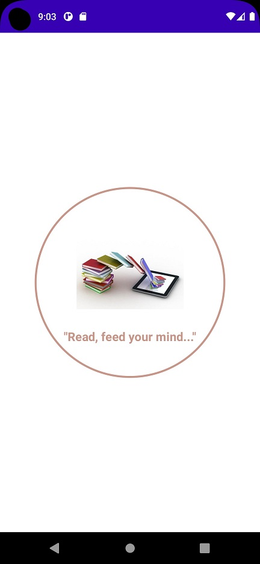
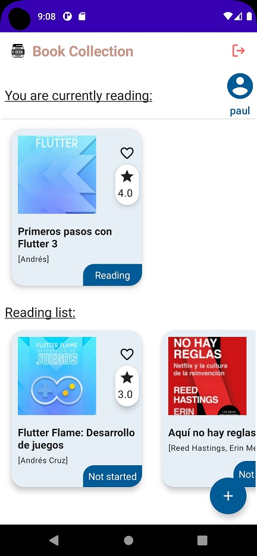
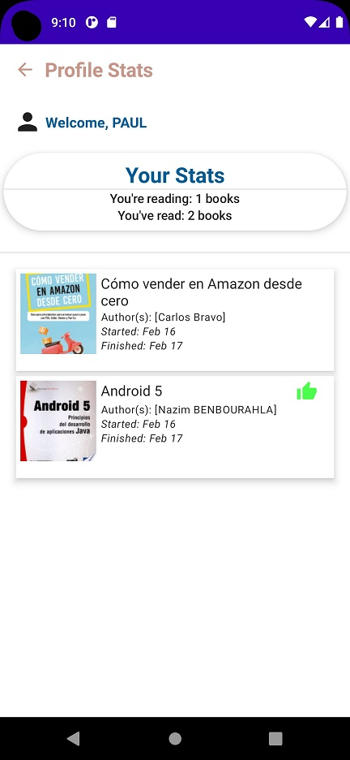
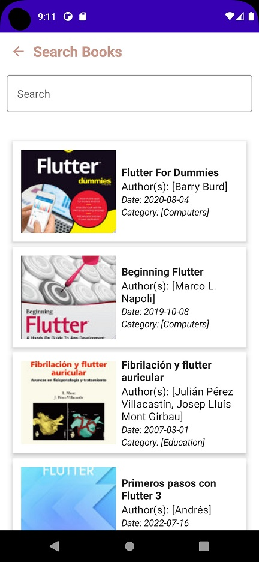
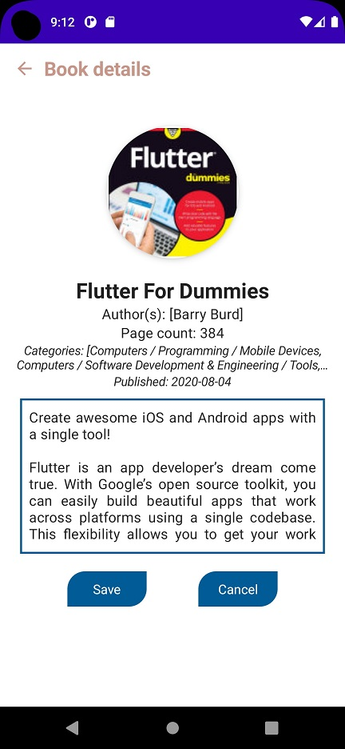
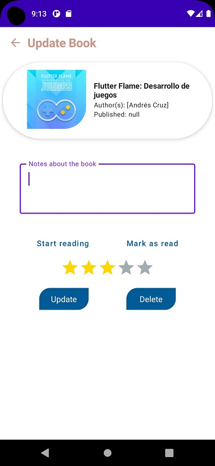

# AS-Compose-MVVM-BooksCollection
Application based on the Firebase platform, which allows you to search for books and save favorites in the database, using the GoogleApis.com API service.

## Architecture Used
MVVM Architecture

## Libraries
- Firebase (Authentication + Firestore)
- Retrofit + Gson
- Hilt + Navigation Compose
- ViewModel
- Coroutines
- Coil

## Output
 ### Splash Screen

 ### Login page

 ### Home page

 ### Profile Stats page

### Search page

### Book Details page

### Update Book page

